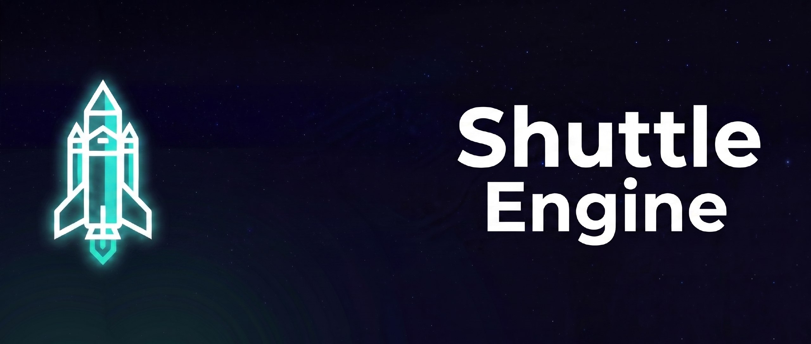

# Shuttle Engine



Shuttle Engine — экспериментальный Vulkan-рендерер и редактор сцен с GPU-driven pipeline, созданный на C++.

Проект объединяет низкоуровневый рендеринг на Vulkan, систему загрузки сцен и окружений, а также редакторский интерфейс для просмотра и настройки результата в реальном времени.

[▶️ Посмотреть демонстрацию на YouTube](https://www.youtube.com/watch?v=CKNqVKySFt0)

---

## Overview

Основная цель проекта — исследовать современные подходы к построению realtime-рендерера:

- **Vulkan 1.3+** (Dynamic Rendering, Bindless, BDA);
- **GPU-driven rendering** (Indirect indexed drawing, Compute passes);
- **HDR & IBL** (Image-based lighting);
- **Интерактивная отладка** (MRT Visual Debugger);
- **Нативный UI** (Win32 API/SDL2 с поддержкой кастомных декораций).

---

## Features

### Rendering
- Vulkan-based rendering backend с использованием Dynamic Rendering.
- Динамическое создание и пересоздание swapchain.
- Индексированная indirect-отрисовка для эффективного рендеринга больших сцен.
- Управление ресурсами GPU с отложенным освобождением (`ResourceBin`).

### GPU-driven pipeline
Pipeline подготовки сцены переносит максимум нагрузки на GPU:
1. Обновление мировых трансформаций.
2. Подсчёт экземпляров мешей.
3. Prefix sum.
4. Построение remap-буфера экземпляров.
5. Подготовка indirect draw commands.

### Assets & Editor UI
Редактор поддерживает импорт и визуализацию сцен (FBX/glTF) и окружений (HDR). Интерфейс включает кастомный заголовок окна, систему вкладок, настройки камеры и рендеринга, а также гибкие режимы отладки.

---

## Debug Rendering

Renderer поддерживает режимы визуализации для глубокой отладки графического конвейера:

- **Геометрия/Пространство:** Albedo, Normal, Tangent, Bitangent, UV, World Position/Normal.
- **PBR:** Metallic, Roughness, AO, Emissive.
- **Глубина и ID:** Linear/View Depth, Mesh/Material/Instance ID.

**Режимы вывода (Viewport Layouts):**
В зависимости от задачи, отладочный вьюпорт может работать в одном из четырех режимов:
1. **Single** — вывод одного выбранного канала.
2. **Split Vertical / Horizontal** — разделение экрана на 2 буфера.
3. **Quad Layout** — одновременный вывод всех 4 отладочных аттачментов в сетке 2x2.

---

## Architecture

Проект разделён на логические уровни:
- **Application:** Управление жизненным циклом, событиями и низкоуровневыми ресурсами (Swapchain, Allocator).
- **MainWindow:** Логика редакторского UI, диалоги файлов и взаимодействие с вьюпортом.
- **Render passes:** Модульная система проходов (WorldTransformUpdatePass, MeshInstancesCountPass, PrefixSumPass, InstanceRemapPass, MainRenderPass, UiPass).

---

## Build

Проект использует CMake:

```bash
git clone <repository-url>
cd ShuttleEngine
cmake -S . -B build
cmake --build build --config Release
```

---

## Project Status

### Implemented
- Полный стек Vulkan (Init, Synchronization, Indirect Rendering).
- Загрузка и импорт сцен (FBX/glTF) и HDR-окружений.
- Кастомный редакторский UI с поддержкой кастомных оконных декораций.
- Развитая система отладки (MRT, Quad Layout).

### Roadmap (Планы развития)
- **Модульность:** Разделение на `Shuttle Engine Runtime` и `Shuttle Editor`.
- **UI:** Переход на `RmlUi` для основного интерфейса (ImGui останется для дебаг-панелей).
- **Инспектор:** Разработка полноценного инспектора ресурсов и иерархии сцены.
- **Отладка:** Реализация независимого 4-проходного рендеринга для каждого квадранта (возможность сравнивать настройки IBL/Tone Mapping в реальном времени).

---

## License

Собственный код проекта распространяется под лицензией MIT. Подробности в файле [`LICENSE`](LICENSE).

## Author

**Shagu**
