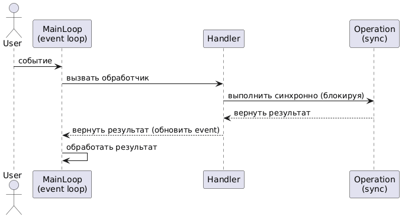
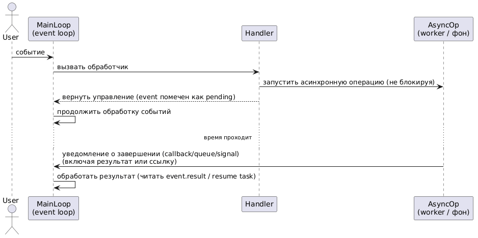

# Vulkan API и асинхронность. Введение. Обзор методов написания асинхронного кода и их недостатков.

## Предисловие

Vulkan API был разработан с учётом современных требований к производительности и гибкости, что делает возможным его использование в асинхронных приложениях. Основная проблема асинхронности заключается в том, что Vulkan API не предоставляет встроенных механизмов для неблокирующего ожидания завершения операций. Это становится задачей для разработчиков, которые должны на своё усмотрение управлять синхронизацией выполнения команд и использования ресурсов.

Данный цикл статей посвящён изучению подходов к реализации асинхронности в Vulkan API. Мы рассмотрим различные методы и техники для эффективного управления асинхронными операциями. Целью является всестороннее рассмотрение возможностей Vulkan API в контексте асинхронного программирования, а также реализация неблокирующего ожидания завершения операций при помощи корутин C++20.

В данной статье мы рассмотрим важность применения асинхронности, рассмотрим проблемы OpenGL и пути решения этих проблем, которое предлагается в Vulkan API. Мы рассмотрим подводные камни при применении множества потоков для работы с Vulkan API.

## Асинхронность и её важность в современных приложениях

Для ряда компонентов критичен интервал между итерациями основного цикла обработки событий (tick interval); в частности, mainLoop не должен блокироваться продолжительным ожиданием операции рендеринга, поскольку это увеличивает задержку обработки событий (latency) и ухудшает восприятие отзывчивости интерфейса (UX). Если скорость поступления событий превышает скорость их обработки, очередь растёт и задержки накапливаются — в системах с ограниченным буфером это может приводить к потере событий. Многие этапы рендера (подготовка command buffers, culling, staging uploads) можно выполнять параллельно, тогда как submit → GPU execute → present требуют сохранения порядка. Перенос подготовки или других тяжёлых задач в worker уменьшает нагрузку mainLoop, но требует явной синхронизации и аккуратного управления временем жизни ресурсов (см. раздел о примитивах синхронизации). Такая модель исполнения называется асинхронностью. Асинхронность не эквивалентна параллельности, однако параллельность может использоваться в методах написания асинхронного кода.

> Асинхронность — модель взаимодействия, при которой момент инициирования операции отделён от момента получения её результата; результат доставляется позднее через callback/future/promise/poll/awaitable.

> Параллелизм - модель выполнения, при которой разные задачи исполняются на разных вычислительных ресурсах.

Ниже приведены диаграммы для наглядного сравнения синхронного и асинхронного выполнения операций.

<table>
  <tr>
    <td align="center">
      
      
<em>Синхронный</em>

    </td>
    <td align="center">
      
      
<em>Асинхронный</em>

    </td>
  </tr>
  <tr>
    <td colspan="2" align="center">
      <strong>Рис. 1 — Сравнение: слева — синхронный сценарий, справа — асинхронный сценарий.</strong>
    </td>
  </tr>
</table>

## Vulkan API и асинхронность

OpenGL – довольно старый API, в котором при работе с многопоточностью возникают существенные трудности. Его архитектура, основанная на глобальном контексте, привязанном к потоку (часто реализуемая через thread_local переменные), делает управление состоянием в разных потоках крайне сложным. Ключевое ограничение спецификации OpenGL заключается в том, что один и тот же контекст не может быть одновременно использован несколькими потоками. То есть, разделять один и тот же контекст между разными потоками запрещено. Это означает, что для выполнения операций OpenGL в разных потоках необходимо либо передавать контекст между потоками (что сериализует доступ и является дорогой операцией), либо создавать отдельные контексты для каждого потока (что усложняет обмен ресурсами между ними). 

Проблемы синхронизации с GPU:
*  В OpenGL команды отправляются на GPU неявно, как только они вызываются. Нет явного механизма для "сборки" команд в буфера и их последующей атомарной отправки.
*  Синхронизация между CPU и GPU в OpenGL также происходит неявно и часто неэффективно. Основным механизмом является функция glFinish(), которая блокирует CPU до полного завершения всех команд на GPU. Это гарантирует синхронизацию, но ценой полной остановки работы CPU, что крайне нежелательно для производительности и отзывчивости приложения.
*  Существуют более "мягкие" варианты, такие как glFlush(), который лишь гарантирует отправку команд на GPU, но не их выполнение, или glFenceSync (в более новых версиях), который позволяет создать точку синхронизации и затем неблокирующе ожидать её на CPU. Однако эти механизмы по-прежнему менее гибкие и гранулированные, чем в Vulkan.
*  Отсутствие явных командных буферов и очередей в OpenGL приводит к тому, что разработчик имеет очень ограниченный контроль над тем, как и когда команды выполняются на GPU, и как происходит синхронизация между различными этапами рендеринга и CPU. Все эти факторы сильно затрудняют эффективное использование OpenGL в современных многопоточных приложениях.

Vulkan API решает данную проблему тем, что больше нет никакого глобального контекста. Теперь всё состояние команд инкапсулируется в объекты и для вызова той или иной функции API требуется явная передача параметров. Большинство объектов в Vulkan API по своей сути константны, а значит большая часть команд безопасна для использования в многопоточной среде. Дизайн Vulkan API был разработан таким образом, чтобы его было удобно использовать в многопоточной среде. Тем не менее есть большое количество команд, которое требует явной синхронизации некоторых объектов (полный список находится в разделе 3.6 спецификации). Как правило, это очереди, буфера, изображения, командные буфера, командные пулы, дескрипторы, дескрипторные пулы, очереди и примитивы синхронизации. Мы подробно исследуем тонкости синхронизации таких объектов позднее.

Команды в Vulkan API разделяются на две большие группы:
1. Команды хоста. Это синхронные вызовы. Как правило - это запросы к драйверу Vulkan API и устройству. К ним относятся, например, команды создания и удаления объектов, использования очереди устройства, работа с памятью и так далее. Существует расширение `VK_KHR_deferred_host_operations`, которое позволяет выполнять асинхронные вызовы на стороне хоста, но это специфично для весьма ограниченного набора задач.
2. Команды устройства. Это асинхронные вызовы. Это непосредственно те команды, которые выполняет устройство. К ним относится рендеринг, копирование данных, вычисления, показ. Такие команды требуют очереди для отправки команд, а также командные буфера для управления последовательностью задач. Для ожидания используют специальные примитивы синхронизации (`VkFence`).

Теперь поговорим о тонкостях каждого аспекта синхронизации для синхронных команд.

## Асинхронные команды
В Vulkan API есть команды, которые выполняются непосредственно на графическом процессоре. Для таких команд в Vulkan API необходимо использовать очередь. Для некоторых задач, например рендеринга, требуется использование командного буфера. Эти команды являются асинхронными. Это значит, что ожидание завершение происходит посредством примитивов синхронизации. Для каждой задачи предназначен определённый тип примитива.
1. Для синхронизации между командами внутри одного командного буфера используют барьеры памяти. Барьеры памяти обеспечивают видимость операций для новых. Например, барьеры могут использоваться для того, чтобы все операции чтения из текстуры предшествовали окончанию рендеринга в него.
2. Для синхронизации между разными Submit'ами используются объекты `VkSemaphore`. Например, они могут обеспечить порядок операций запись в изображение → использование в качестве текстуры.
3. Для синхронизации между устройством и хостом используются объекты `VkFence`. Они используются тогда, когда нужно дождаться завершения выполнения команд на стороне хоста. Например, если требуется дождаться готовности рендеринга мы используем `fence`, чтобы убедиться в том, что командный буфер выполнился и мы сможем писать в него команды для отрисовки нового кадра.
4. Для особых случаев синхронизации может использоваться также `VkEvent`. Его использование не так часто требуется, поэтому мы его рассматривать не будет.

В версии **1.2** или с расширением `VK_KHR_timeline_semaphore` появились timeline semaphores. Это позволяет для последовательно идущих операций использовать один семафор. Например, для рендеринга в `swapchain` можно использовать один семафор для всех операций рендеринга, а затем использовать `vkWaitSemaphores` для ожидания завершения всех операций. Это позволяет упростить код и избежать необходимости создавать множество семафоров для каждой операции.

Избегайте чрезмерной синхронизации, особенно использования `VKFence`. Он полезен именно только тогда, когда ожидание завершения операции на устройстве является необходимым разграничением для избежания состояния гонок, а также если действительно необходимо обеспечить строгий порядок операций. Это лишает преимуществ параллелизма, поскольку превращает асинхронный код в последовательность. Отдавайте приоритет барьерам и семафорам, если это возможно. Так вы сможете не только сократить использование `VkFence`, но и минимизировать количество вызовов `vkQueueSubmit`. Помните, что каждый вызов `Submit` — это прямое обращение к драйверу, которое является дорогостоящей операцией. Группировка команд и использование внутренних механизмов синхронизации GPU позволяют максимально эффективно использовать ресурсы хоста.

## Примитивы синхронизации и команды хоста
Нужно быть внимательным с использованием примитивов синхронизации, когда речь заходит об их использовании в командах хоста. Некоторые из них могут менять их состояние, поэтому требуется обеспечивать эксклюзивный доступ, чтобы избегать состояния гонок. Для начала разберёмся с объектом `VkFence` для каких команд требуется внешняя синхронизация. Условно говоря, можно разделить на следующие группы:
1. Команды с очередями, которые используют `VkFence`. С одной стороны, мы должны обеспечить эксклюзивный доступ к объекту `fence`. С другой стороны, мы должны следить за тем, чтобы в разных вызовах использовался один объект `fence` для параллельных вызовов. Если мы желаем использовать один и тот же `fence`, то убедитесь, что все команды с его использованием завершены и вы сбросили его состояние.
2. Команды для сброса всех переданных `VkFence`. Здесь также необходимо убедиться в том, что никакой элемент массива `pFences` не используется в других командах, и он не назначен для ожидания команды с очередью.
3. Команды для ожидания доступного изображения из `swapchain`.
4. Команды для импорта `VkFence` из объекта для системных вызовов. Это может использоваться для синхронизации между различными процессами.
5. Команда для уничтожения объекта `VkFence`. Здесь вы должны убедиться в том, что этот объект не используется ни в каком вызове, а также все асинхронные вызовы, связанные с ним, завершены.

Теперь рассмотрим команды используемые `VkSemaphore`. К командам, которые требуют синхронизации, относятся следующие:
1. Команды для получения свободного изображения из `swapchain`.
2. Команды для импорта `semaphore` из объекта ОС для системных вызовов.
3. Уничтожение `semaphore`.

Напоследок приведём короткий список команд для работы с событиями:
1. `vkDestroyEvent` - уничтожение объекта.
2. `vkSetEvent` - установка события.
3. `vkResetEvent` - сброс события.

## Синхронизация в работе с памятью устройства

Операции отображения и отмены отображения в виртуальном адресном пространстве процесса, а также освобождения памяти, требуется синхронизация доступа к `VkDeviceMemory`. Убедитесь, что вы обеспечили эксклюзивный доступ к `memory`.

## Синхронизация в работе с буферами и изображениями

Для того чтобы обеспечить эксклюзивный доступ к буферам и изображениям. Нужно убедиться не только в том, что оно не используются в текущих хост операциях, но и в операциях на устройстве. Если привязка памяти происходит во время рендеринга, то возникает гонка данных, что может привести к артефактам или падению программы.

1. Привязка ресурсов к памяти требует эксклюзивного доступа к ним. Убедитесь, что вы их не используете в операциях
2. Уничтожение ресурсов также требует окончания всех зависимых от них команд.

## Синхронизация в работе с показом и поверхностью

Отдельно стоит рассмотреть работу в многопоточной среде с показом. В основном требуется обеспечить эксклюзивный доступ к `swapchan`. Из основных операций с цепочкой показа безопасны следующие:
1. Получение списка изображений из цепочки показа.
2. Захват и освобождение полноэкранного эксклюзивного режима.

Вообще, для использования `swapchain` существует большое количество расширений. Если вы хотите очень тонко регулировать контроль за безопасностью от состояния гонки здесь лучше самим просмотреть список команд, которые вы собираетесь использовать. Но в целом, я бы рекомендовал для простоты реализации использовать главный поток для всех операций. Поскольку в данном случае очень много нюансов, которые может быть не так просто контролировать.

При использовании поверхности следует синхронизировать доступ в случае, когда нам нужно создать цепочку обмена и получить список поддерживаемых режимов показа, а также получить список областей вывода при работе с группами устройств (Прим.: мы не будем рассматривать работу с группами устройств, поскольку обычно используется одно устройство).

## Работа с очередями

Эксклюзивный доступ (внешняя синхронизация) к очередям Vulkan API критически важен для предотвращения состояний гонки при выполнении большинства операций: отправке командных буферов (`vkQueueSubmit`), использовании семафоров (`vkQueueWaitSemaphores`) или фенсов (`vkQueueWaitIdle`). Исключение составляет лишь чтение состояния очереди, например, получение списка изображений (`vkGetSwapchainImagesKHR`) или запросы свойств, которые не модифицируют её внутреннее состояние.

Основная сложность работы с очередями в Vulkan API заключается в том, что они создаются и выделяются драйвером только один раз — на этапе инициализации логического устройства (`VkDevice`). Мы не можем динамически создавать новые очереди по мере необходимости, поскольку их количество жестко ограничено физическими свойствами графического процессора и его семейств очередей (`VkQueueFamilyProperties`). Это означает, что несколько потоков или подсистем приложения могут конкурировать за ограниченное количество доступных очередей, что делает эффективное и безопасное управление ими в многопоточной среде нетривиальной задачей. В следующих статьях мы подробно рассмотрим архитектурные паттерны и подходы, которые позволяют безопасно и эффективно работать с очередями в условиях многопоточности.

## Работа с командными буферами и пулами команд

Работа с командами осуществляется с помощью командных буферов и командных пулов. Командные буфера представляют собой набор последовательно расположенных команд для выполнения на устройстве. Пул команд представляет собой механизм управления памятью для размещения команд. Пул команд и командный буфер не защищены при работе с несколькими потоками. Кроме того при записи в командные буфера нужно, во-первых, обеспечить внешнюю синхронизацию для командных буферов, в которые пишутся команды, и, во-вторых, командный пул также неявно требует внешней синхронизации, когда в выделенный из него командный буфер пишется команда. Иными словами, даже если вы пишете в разные командные буфера, вы должны убедиться в том, что они не выделены из одного и того же пула команд.

## Работа с дескрипторами

В vulkan API все данные передаются в шейдер при помощи дескрипторных наборов. В некоторых случаях также требуется внешняя синхронизация. Для работы с дескрипторами используются следующие типы:
1. `VkDescriptorPool` - представляет собой объект, управляющий памятью дескрипторов. Он отвечает за выделение памяти для дескрипторов.
2. `VkDescriptorSetLayout` - представляет собой объект, который является макетом размещения дескрипторов. Определяет порядок дескрипторов в наборе.
3. `VkDescriptorSet` - представляет собой набор дескрипторов, используемых в шейдерах. Например, чтобы шейдер получил доступ к текстуре, нужно создать набор дескрипторов и записать туда текстуру.

Теперь определим набор методов, которые требуют внешнюю синхронизацию при работе с дескрипторами. Рассмотрим пул дескрипторов.
1. `vkDestroyDescriptorPool` - используем в последний момент. Уничтожает весь пул, а следовательно и все наборы, которые были выделены из него. Отложите его использование, пока все дескрипторные наборы не будут уничтожены.
2. `vkResetDescriptorPool` - убедитесь, что ваш пул больше нигде не используется, а также все выделенные из него наборы дескрипторов.
3. `vkFreeDescriptorSets` - убедитесь, что все наборы дескрипторов больше нигде не используются. Также ваш пул требует внешней синхронизации.
4. `VkDescriptorSetAllocateInfo`.
5. `pDescriptorWrites`. Каждый элемент `dstSet` должен иметь внешнюю синхронизацию.

## Синхронизация при завершении работы с очередями и устройством

В Vulkan API существует две команды для ожидания завершения работы. Первая - это `vkDeviceWaitIdle`. Данная функция нужна для того, чтобы дождаться завершения работы устройства. Перед вызовом удаления устройства необходимо вызывать данную функцию. Так вы избежите неопределённого поведения в том, случае, если устройство продолжает работу. Вторая - `vkQueueWaitIdle`. Она дожидается завершения всех операций на выбранной очереди.

С этими функциями нельзя параллельно вызывать все другие функции, которые связаны с работой с очередью. Если мы вызываем `vkQueueWaitIdle`, мы должны обеспечить внешнюю синхронизацию для параметра `queue`. Если мы вызываем команду `vkDeviceWaitIdle`, мы неявно должны обеспечить синхронизацию для всех очередей, которые были созданы вместе с устройством (параметр `device`).

## Жизненный цикл объектов. Безопасное удаление

В данном случае мы должны предотвратить следующие случаи
1. Двойное удаление.
2. Удаление ресурсов во время их использования (Например, в рендеринге).

Если ресурс выходит из области видимости, следует дождаться завершения всех асинхронных операций, связанных с данным ресурсом. Для этого в месте использования ресурса можно повесить на него объект `VkFence`, который будет использоваться в процедуре его уничтожения, перед вызовом `vkDestroy...`. Не рекомендуется использовать функцию `vkQueueWaitIdle` или `vkDeviceWaitIdle`, так как в таком случае придётся остановить отправку новых команд в очередь.

## Требования к архитектуре

К архитектуре решения предъявляются следующие требования:
1. Никаких блокировок. Блокировки могут блокировать потоки из пула. Недопустима такая ситуация, когда все потоки из пула оказываются в состоянии блокировки.
2. Неблокирующее ожидание. Вместо того чтобы блокировать поток для ожидания, мы будем переключаться на новую задачу.
3. Требуется обеспечить эксклюзивный доступ к объектам, для которых требуется внешняя синхронизация.
4. Архитектура должна обеспечить безопасность многопоточности для объектов, требующих внешней синхронизации при использовании в командах устройства (те, что исполняются в буферах или через использование очереди).
5. Архитектура должна учитывать некоторые ограничения, которые накладывает использование API (Например, ограниченное количество очередей).
